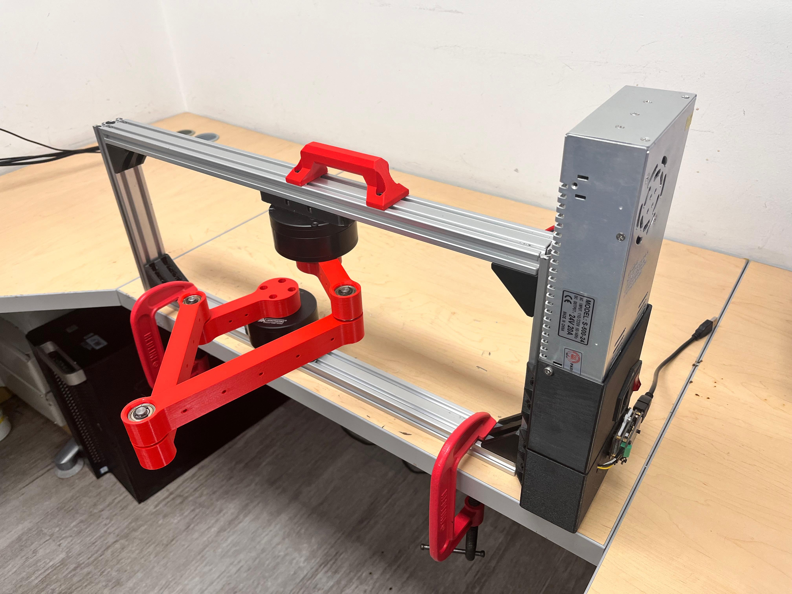
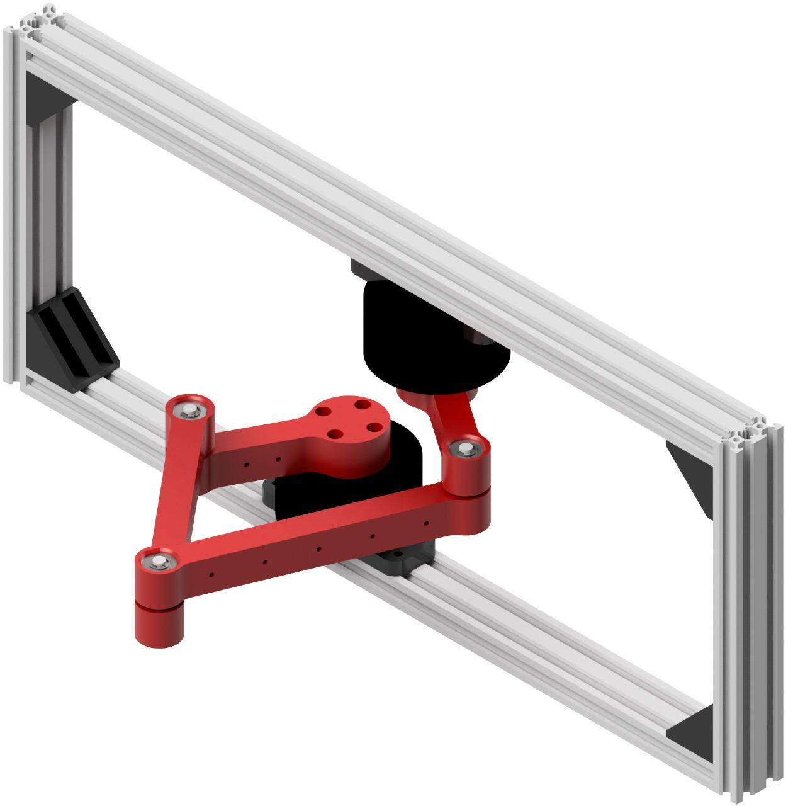
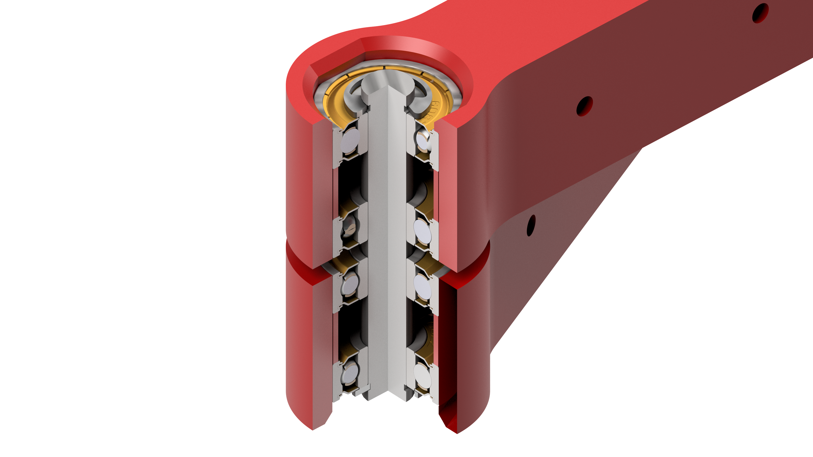

# Master-Thesis

## Introducción
Este es mi repositorio de tesis de maestría de la Universidad de Los Andes. Esta tesis estudia la implementación de algoritmos de aprendizaje por refuerzo profundo para la planeación de trayectorias de mínimo consumo energético en un robot paralelo.
<p align="center">
  
</p>
<p align="center">
  
</p>
<p align="center">
  
</p>

## Prerequsitos
- Python 3.12
- ffmpeg
- pip
- virtualenv

## Configuración del Entorno de Desarrollo


### Configuración del Entorno Python

1. **Clona el Repositorio**

    Clona este repositorio a tu máquina local usando el siguiente comando Git:

    ```bash
    git clone https://github.com/wampah/Master-Thesis.git
    cd Master-Thesis
    ```

2. **Crea y Activa un Entorno Virtual**

    Crea un entorno virtual para manejar las dependencias del proyecto de manera aislada:

    ```bash
    virtualenv mthesis_env --python=python3.12
    ```

    Activa el entorno virtual:

    - En Windows:
        ```bash
        .\mthesis_env\Scripts\activate
        ```

    - En macOS y Linux:
        ```bash
        source mthesis_env/bin/activate
        ```

3. **Instala las Dependencias**

    Con el entorno virtual activo, instala las dependencias necesarias ejecutando:

    ```bash
    pip install torch torchvision torchaudio --index-url https://download.pytorch.org/whl/cu128
    pip install -r requirements.txt
    ```

    Nota: El "requirements.txt" incluye las librerias de pytorch para CUDA. Estas no se pueden descargar via pipor lo cual se deben  descargar con el comando especificado.

4. **Instala el Paquete en Modo Editable**

    Para instalar el paquete en modo editable, ejecuta el siguiente comando:


    ```bash
    pip install -e .
    ```

## Licencia
Este proyecto está bajo la Licencia MIT - consulta el archivo `LICENSE` para más detalles.